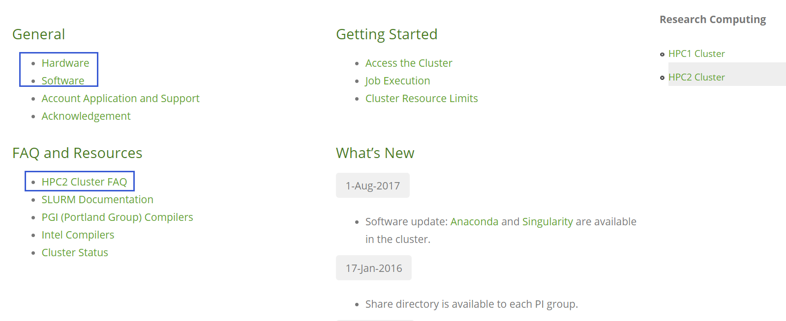

## Recording

- Producing npy file and h5 file( 3 Feb, 2020)；1)generate npy and h5 files; 2) trian the segmentation model on the newly labeled MEP data. 

## Plan and resources

### 3 Feb~3 Mar

- labeling WRII dataset; download from the link: [WRII](https://hkustconnect-my.sharepoint.com/:f:/g/personal/bwangbb_connect_ust_hk/ElLhGqoZ_05PgtmtXhasLKMBKj6c9WDjAd--ZbJhxVG63w?e=Tfo7LS).

- use HKUST hpc2 to train the model
  - apply hpc2 account; Chao already send the application template.

  - set the DL working env, mainly install tensorflow-gpu, other common scientific packages;check chao's `MEPNet v0.1 and HPC2.pptx` under resources/ppt folder.

  - run the model with 1 GPU; just check PointNet code.

  - run the model with 4 GPUs; need modify pointnet code to enable the model run with 4 GPUs, one example is * [Tensorflow code for training different architectures on ImageNet dataset + Multi-GPU support + Transfer Learning support](https://github.com/arashno/tensorflow_multigpu_imagenet).

- visulaization and preliminary analysis
   - visualization using tensorboard, e.g.: the loss, accuracy graph , the code is already in the pointnet code. check the below first 2 books which illustrate in detail on how to use tensorboard.
   - draw the confusion matrix and Precision-Recall or ROC curve.
   - draw some conclusion based on yr experiment results
   
 Note: you may need repeat experiments many times for better performance. Follow the workflow  ideas--> experiment setting --> experiments --> analysis, then repeat this cycle until you find something intersting or useful.

## useful resources

Books 
- `deep learning with python`, an extremely classic and concise book on deep learning.
- `hands-on machine learning with scikit-learn, keras and Tensorflow`, 2nd version; mainly chapter 02-04 and CNN chapter.
- `machine learning yearning`, a collection of practical machine learning techniques to build yr intelligent system.
 
P.S.: books can be downloaded from https://b-ok.org/, and their code projects of the first 2 books are released on github.

hpc2
- [HPC2 Cluster](https://itsc.ust.hk/services/academic-teaching-support/high-performance-computing/hpc2-cluster), focus on software and FAQ link.

- linux commands and shell scripting, you may refer the book `The Linux Command Line`.

other
* [Tensorboard Tutorial: Graph Visualization with Example](https://www.guru99.com/tensorboard-tutorial.html)
* [www.google.com](https://www.google.com/)  
* [Stack Overflow - Where Developers Learn, Share, & Build Careers](https://stackoverflow.com/)

## how to update or contribute to our documents

check [How to Contribute to Someone's GitHub Repository](http://www.youtube.com/watch?v=yr6IzOGoMsQ)